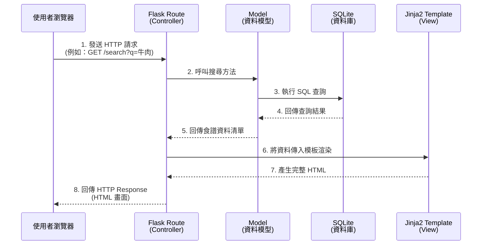

# 搜尋食譜系統 - 系統架構設計

這份文件根據 `docs/PRD.md` 的功能需求，定義了本系統的技術架構與資料夾結構。本專案採用傳統的伺服器端渲染（Server-Side Rendering）架構。

## 1. 技術架構說明

- **後端框架**：Python + Flask。選擇 Flask 是因為它輕量且具有極高的彈性，非常適合用來快速打造像是食譜系統這樣的中小型網頁應用。
- **模板引擎**：Jinja2。Jinja2 是 Flask 預設的模板系統，可以直接在 HTML 中嵌入 Python 邏輯，負責處理頁面的動態內容渲染，不需要再額外架設前端框架（如 React/Vue）。
- **資料庫**：SQLite。做為輕量級關聯式資料庫，它不需額外安裝伺服器，資料會儲存在本地檔案中，適合 MVP 階段快速開發與測試。

### MVC 模式對應說明

本系統借鑒 MVC (Model-View-Controller) 架構模式來組織程式碼：
- **Model（模型）**：負責與 SQLite 資料庫溝通，處理資料的讀寫邏輯（例如：尋找食譜、新增食譜）。
- **View（視圖）**：對應到 Jinja2 Templates，只負責處理畫面的呈現，接收從 Controller 傳來的資料並渲染成 HTML 返回給使用者的瀏覽器。
- **Controller（控制器）**：對應到 Flask 的 Routes（路由），負責接收使用者的 HTTP 請求、呼叫 Model 取得資料，並將資料傳遞給 View 進行畫面渲染。

## 2. 專案資料夾結構

以下為本專案建議的資料夾結構，以保持程式碼的模組化與可維護性：

```text
web_app_development/
├── app/
│   ├── __init__.py      ← 負責初始化 Flask 應用程式與載入設定
│   ├── models/          ← (Model) 資料庫邏輯與 SQLite 操作
│   │   ├── __init__.py
│   │   ├── user.py      ← 使用者資料模型 (註冊/登入)
│   │   └── recipe.py    ← 食譜資料模型 (查找/儲存/撰寫/評分)
│   ├── routes/          ← (Controller) Flask 路由與商業邏輯
│   │   ├── __init__.py
│   │   ├── auth.py      ← 認證相關路由 (/login, /register)
│   │   └── recipe.py    ← 食譜相關路由 (/search, /recipe/<id>)
│   ├── templates/       ← (View) Jinja2 HTML 模板
│   │   ├── base.html    ← 基礎排版（包含 Navbar, Footer）
│   │   ├── index.html   ← 首頁與搜尋介面
│   │   ├── login.html   ← 登入/註冊頁面
│   │   └── recipe_detail.html ← 食譜詳細資訊頁面
│   └── static/          ← 靜態資源檔案
│       ├── css/
│       │   └── style.css
│       ├── js/
│       │   └── main.js
│       └── images/      ← 存放預設圖片或上傳的食譜圖片
├── instance/
│   └── database.db      ← SQLite 實體資料庫檔案 (不進版本控制)
├── docs/                ← 專案文件目錄
│   ├── PRD.md
│   └── ARCHITECTURE.md  ← 本文件
├── app.py               ← 專案進入點 (執行此檔案啟動伺服器)
└── requirements.txt     ← Python 依賴套件清單
```

## 3. 元件關係圖

以下圖示展示了當使用者在瀏覽器輸入網址或點擊按鈕時，系統內部元件如何互相協作。



## 4. 關鍵設計決策

1. **模組化路由 (Blueprints)**：我們在 `routes/` 目錄下將路由切分為 `auth.py` 與 `recipe.py`。在初期就能讓程式碼保持整潔，避免所有的邏輯都擠在同一個檔案內。
2. **共用基礎模板 (Template Inheritance)**：在 `templates/` 中建立 `base.html`，使用 Jinja2 的繼承機制（``）。這樣未來 Navbar 或共用載入的 CSS 修改時，只需改一個檔案。
3. **資料庫檔案隔離**：將 `database.db` 放置於 `instance/` 資料夾內。這有助於區隔程式碼庫與應用程式執行的動態數據，且方便將 `instance/` 加入 `.gitignore` 防止資料庫檔案被加入版本控制。
4. **前後端不分離的選擇**：為求快速驗證產品（MVP），選擇由 Flask 直接回傳 HTML。這樣能省去開發 RESTful API 和維護兩套系統（前端框架＋後端）的初期成本。
