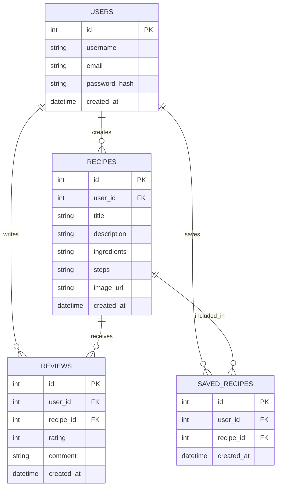

# 搜尋食譜系統 - 資料庫設計文件

本文件詳細說明系統的資料庫設計，包含實體關係圖 (ER Diagram)、各個資料表的欄位定義，以及對應的模型實作。

## 1. ER 圖 (實體關係圖)

## 2. 資料表詳細說明

### 2.1 USERS (使用者表)
儲存註冊使用者的基本資料與認證資訊。
- `id`: INTEGER, Primary Key, 自動遞增。
- `username`: TEXT, 必填, 顯示名稱。
- `email`: TEXT, 必填, 唯一, 用於登入。
- `password_hash`: TEXT, 必填, 密碼雜湊值。
- `created_at`: DATETIME, 必填, 帳號建立時間。

### 2.2 RECIPES (食譜表)
儲存使用者分享的食譜內容。為求 MVP 簡單化，食材 (`ingredients`) 與步驟 (`steps`) 直接以 TEXT 格式儲存（可使用換行符號分隔）。
- `id`: INTEGER, Primary Key, 自動遞增。
- `user_id`: INTEGER, Foreign Key (USERS.id), 必填, 作者 ID。
- `title`: TEXT, 必填, 食譜標題。
- `description`: TEXT, 簡短說明。
- `ingredients`: TEXT, 必填, 食材清單。
- `steps`: TEXT, 必填, 料理步驟。
- `image_url`: TEXT, 封面圖片路徑（可空）。
- `created_at`: DATETIME, 必填, 建立時間。

### 2.3 REVIEWS (評論與評分表)
儲存使用者對某篇食譜的評價。
- `id`: INTEGER, Primary Key, 自動遞增。
- `user_id`: INTEGER, Foreign Key (USERS.id), 必填, 評論者。
- `recipe_id`: INTEGER, Foreign Key (RECIPES.id), 必填, 被評論的食譜。
- `rating`: INTEGER, 必填, 星星數 (1-5)。
- `comment`: TEXT, 評論內容。
- `created_at`: DATETIME, 必填, 建立時間。

### 2.4 SAVED_RECIPES (收藏表)
儲存使用者收藏了哪些食譜，屬於多對多 (Many-to-Many) 的關聯表。
- `id`: INTEGER, Primary Key, 自動遞增。
- `user_id`: INTEGER, Foreign Key (USERS.id), 必填。
- `recipe_id`: INTEGER, Foreign Key (RECIPES.id), 必填。
- `created_at`: DATETIME, 必填, 收藏時間。

## 3. SQL 建表與 Model 實作
- **建表語法**：位於 `database/schema.sql`
- **Python Model**：位於 `app/models/` 目錄中，採用內建的 `sqlite3` 進行封裝，包含基本的 CRUD 操作。
