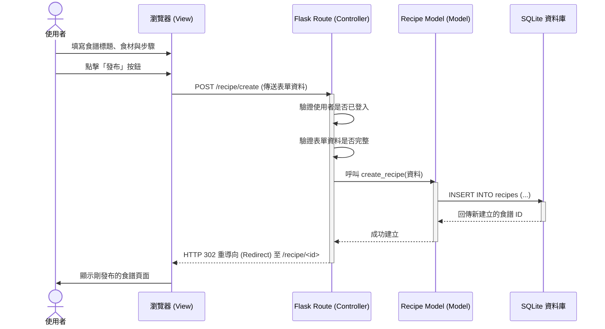

# 搜尋食譜系統 - 流程圖與路徑設計

本文件依據 PRD 所定義的功能需求與 ARCHITECTURE 所規劃的技術架構，繪製系統的使用者操作流程與內部資料流。

## 1. 使用者流程圖 (User Flow)

此流程圖展示了使用者進入網站後，可以進行的各項主要操作路徑。

```mermaid
flowchart LR
    Start([使用者進入網站]) --> Home[首頁 (搜尋列與熱門推薦)]
    
    Home --> Search{尋找食譜？}
    Search -->|輸入關鍵字| ResultList[搜尋結果列表]
    ResultList --> Detail[食譜詳細內容頁]
    
    Detail --> Action{登入狀態？}
    Action -->|未登入| Login[前往登入/註冊頁]
    Login --> Detail
    
    Action -->|已登入| LoggedActions{執行操作}
    LoggedActions -->|點擊收藏| SaveAction[儲存至個人收藏夾]
    LoggedActions -->|給予評價| ReviewAction[提交評分與評論]
    LoggedActions -->|點擊採買| ListAction[產生購物清單]
    
    Home --> Create{分享食譜？}
    Create -->|未登入| Login
    Create -->|已登入| WriteForm[填寫食譜表單 (食材、步驟)]
    WriteForm --> Submit[發布新食譜]
    Submit --> Detail
```

## 2. 系統序列圖 (Sequence Diagram)

此圖以「使用者撰寫並發布食譜」為例，展示從前端瀏覽器到後端 Flask 與 SQLite 的資料流動過程。



## 3. 功能清單對照表

根據 PRD 定義的核心功能，初步規劃對應的 URL 路徑與 HTTP 請求方法：

| 功能名稱 | URL 路徑 | HTTP 方法 | 說明 |
| :--- | :--- | :--- | :--- |
| **首頁/熱門推薦** | `/` | GET | 顯示首頁搜尋框與精選食譜 |
| **搜尋食譜** | `/search` | GET | 接收 `?q=關鍵字` 參數並顯示結果 |
| **檢視食譜詳細內容** | `/recipe/<id>` | GET | 顯示特定食譜的食材、步驟與評論 |
| **註冊帳號** | `/register` | GET/POST | 顯示註冊表單 / 處理註冊邏輯 |
| **登入系統** | `/login` | GET/POST | 顯示登入表單 / 處理登入邏輯 |
| **登出系統** | `/logout` | GET | 清除 Session 並登出 |
| **撰寫新食譜** | `/recipe/create` | GET/POST | 顯示新增表單 / 將新食譜存入資料庫 |
| **儲存/收藏食譜** | `/recipe/<id>/save` | POST | 將特定食譜加入使用者的收藏清單 |
| **提交評分與評論** | `/recipe/<id>/review` | POST | 接收使用者針對該食譜的留言與星星數 |
| **產生購物清單** | `/recipe/<id>/shopping-list` | GET | 根據該食譜的食材清單產生購物清單 |
